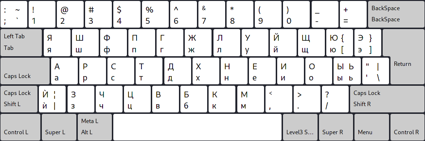

# Layout de teclado russo Colemak

Tradução: [english](README.md), [русский](README.ru.md), [中文](README.zh-CN.md), [español](README.es.md), [العربية](README.ar.md), [bahasa](README.id.md), [türkçe](README.tr.md), [български](README.bg.md), [esperanto](README.eo.md)

Esta é minha tentativa de fazer um layout de teclado baseado no Colemak, adaptado para o idioma russo e o alfabeto cirílico.
É importante ressaltar que não falo nem escrevo em russo, originalmente fiz esse layout de teclado para o idioma búlgaro, depois ajustei para russo.

> Arquivado, veja (https://github.com/salif/colemak-ru/discussions/1#discussioncomment-10247941).

## Links

* [Código fonte](https://codeberg.org/salif/colemak-ru)
* [Discussões (Github)](https://github.com/salif/colemak-ru/discussions)
* [Sala de bate-papo (Element/Matrix)](https://matrix.to/#/#salif-colemak:mozilla.org)

## Instalando

### Instalando no Linux

Veja esta página: [LINUX.pt.md](./LINUX.pt.md)

### Instalando em outros sistemas operacionais

Não posso te ajudar, tente encontrar você mesmo uma maneira de instalar no seu sistema operacional.

## Contribuindo

Se você encontrar um bug ou quiser sugerir uma melhoria, sinta-se à vontade para compartilhá-lo no [Codeberg] ou [Github] ou enviar uma solicitação pull.

[Github]: https://github.com/salif/colemak-ru/discussions
[Codeberg]: https://codeberg.org/salif/colemak-ru/issues

## Outros layouts de teclado

* [Para língua búlgara](https://salif.github.io/colemak-bg/)
* [Para o idioma turco](https://salif.github.io/colemak-tr/)
* [Para a língua esperanto](https://salif.github.io/colemak-eo/)

---

Esta página contém texto traduzido automaticamente
