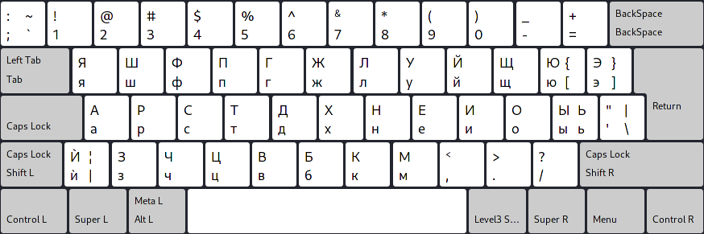

# Rusça Colemak klavye düzeni

Tercüme: [english](README.md), [русский](README.ru.md), [中文](README.zh-CN.md), [español](README.es.md), [العربية](README.ar.md), [português](README.pt.md), [bahasa](README.id.md), [български](README.bg.md), [esperanto](README.eo.md)

Bu benim Colemak'ı temel alan, Rus diline ve Kiril alfabesine uyarlanmış bir klavye düzeni yapma girişimim.
Şunu da belirtmekte fayda var ki ben Rusça konuşamıyorum ve yazmıyorum, bu klavye düzenini ilk başta Bulgarca için yapmıştım, daha sonra Rusçaya göre ayarladım.

> Arşivlendi, bkz (https://github.com/salif/colemak-ru/discussions/1#discussioncomment-10247941).

## Bağlantılar

* [Kaynak kodu](https://codeberg.org/salif/colemak-ru)
* [Tartışmalar (Github)](https://github.com/salif/colemak-ru/discussions)
* [Sohbet odası (Element/Matrix)](https://matrix.to/#/#salif-colemak:mozilla.org)

## Kurulum

### Linux'ta kurulum

Bu sayfaya bakın: [LINUX.tr.md](./LINUX.tr.md)

### Diğer işletim sistemlerine kurulum

Size yardımcı olamam, işletim sisteminize kendiniz yüklemenin bir yolunu bulmaya çalışın.

## Katkı

Bir hata bulursanız veya bir iyileştirme önermek isterseniz, bunu [Codeberg] veya [Github] üzerinde paylaşmaktan veya bir çekme isteği göndermekten çekinmeyin.

[Github]: https://github.com/salif/colemak-ru/discussions
[Codeberg]: https://codeberg.org/salif/colemak-ru/issues

## Diğer klavye düzenleri

* [Bulgar dili için](https://salif.github.io/colemak-bg/)
* [Türkçe dili için](https://salif.github.io/colemak-tr/)
* [Esperanto dili için](https://salif.github.io/colemak-eo/)

---

Bu sayfa otomatik olarak çevrilmiş metin içermektedir
